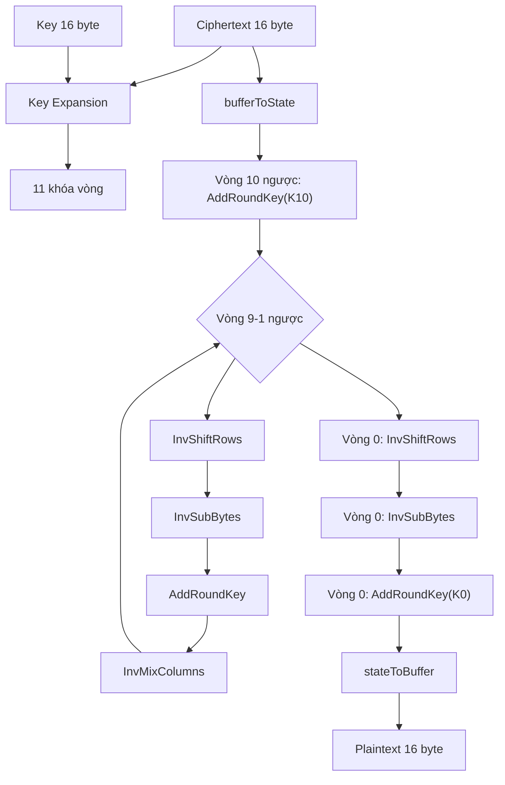
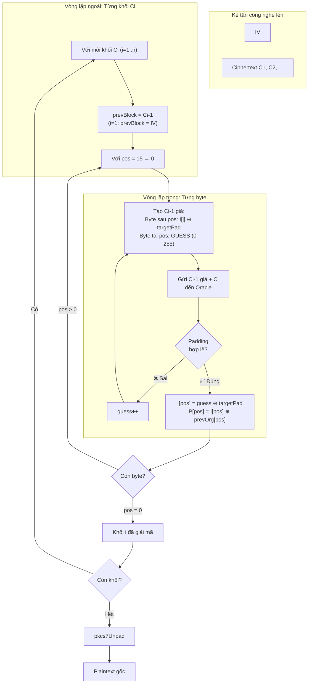

# 🎓 Đồ Án Mô Phỏng AES-128 & Tấn Công Padding Oracle

**Trường Đại học Bách Khoa Hà Nội (HUST)** — Thực hiện: Lê Gia Bảo & An

---

## Mục Lục

1. [Giới Thiệu](#giới-thiệu)
2. [Cấu Trúc Dự Án](#cấu-trúc-dự-án)
3. [Cách Chạy](#cách-chạy)
4. [Mô Tả Chi Tiết Hàm](#mô-tả-chi-tiết-hàm)
   - [aes128.js](#aes128js)
   - [padding_oracle_demo.js](#padding_oracle_demojs)
5. [Luồng Chạy Code](#luồng-chạy-code)
   - [Luồng Mã Hóa AES-128](#luồng-mã-hóa-aes-128)
   - [Luồng Giải Mã AES-128](#luồng-giải-mã-aes-128)
   - [Luồng Tấn Công Padding Oracle](#luồng-tấn-công-padding-oracle)
6. [Độ Phức Tạp Thuật Toán](#độ-phức-tạp-thuật-toán)
7. [Đánh Giá & Phân Tích](#đánh-giá--phân-tích)
8. [Ghi Chú Bảo Mật](#ghi-chú-bảo-mật)

---

## Giới Thiệu

Dự án này mô phỏng **thuật toán mã hóa khối AES-128** từ các phép toán cơ bản (không dùng thư viện) và minh họa **lỗ hổng Padding Oracle Attack** — một trong những lỗ hổng mật mã nổi tiếng nhất đã từng ảnh hưởng đến TLS, một số triển khai JWE/JWT dùng CBC/padding, ASP.NET, Java Server Faces và nhiều hệ thống thực tế.

### Mục Tiêu

| Mục tiêu | Mô tả |
|----------|-------|
| **Hiểu AES** | Cài đặt từng bước AES-128: S-Box, ShiftRows, MixColumns (GF(2⁸)), Key Expansion |
| **Hiểu tấn công** | Mô phỏng cách hacker khôi phục plaintext mà không cần biết khóa bí mật |
| **Giáo dục** | Code có comment tiếng Việt chi tiết, phù hợp cho sinh viên học mật mã |

---

## Cấu Trúc Dự Án

```
.
├── aes128.js                  # Lớp AES128: mã hóa + giải mã 1 khối
├── padding_oracle_demo.js     # Mô phỏng tấn công Padding Oracle (AES-CBC)
├── README.md                  # File này — tài liệu & đánh giá
└── AGENTS.md                  # Hướng dẫn cho AI coding agent
```

---

## Cách Chạy

### Yêu cầu

- **Node.js** >= 14.x (để dùng `crypto`, `Buffer`)

### Chạy Demo AES-128

```bash
node aes128.js
```

Kết quả: Mã hóa và giải mã một khối 16 byte, in chi tiết từng vòng.

### Chạy Demo Tấn Công Padding Oracle

```bash
node padding_oracle_demo.js
```

Kết quả:
1. So sánh AES128 tự cài với Node.js `crypto`
2. Tấn công Padding Oracle — khôi phục **toàn bộ** plaintext

---

## Mô Tả Chi Tiết Hàm

### aes128.js

Lớp `AES128` chứa toàn bộ cài đặt thuật toán AES-128 (mã hóa và giải mã).

#### Bảng Tra Cứu Tĩnh

| Thuộc tính | Kiểu | Kích thước | Mô tả |
|------------|------|-----------|-------|
| `SBOX` | `Uint8Array` | 256 byte | Bảng thế phi tuyến (SubBytes) |
| `INV_SBOX` | `Uint8Array` | 256 byte | Bảng thế nghịch đảo (InvSubBytes) |
| `RCON` | `Uint8Array` | 11 byte | Hằng số vòng (Round Constant) |

#### Các Hàm Tiện Ích

| Hàm | Tham số | Trả về | Mô tả | Độ phức tạp |
|-----|---------|--------|-------|-------------|
| `bytesToHex(bytes)` | `Uint8Array\|Array` | `string` | Chuyển mảng byte → chuỗi hex | O(n) |
| `printState(label, state)` | `string, Uint8Array` | — | In ma trận State 4×4 dạng hex | O(1) |

#### Quản Lý Trạng Thái

| Hàm | Mô tả | Độ phức tạp |
|-----|-------|-------------|
| `bufferToState(buffer)` | Copy 16 byte đầu vào → State (column-major) | O(1) |
| `stateToBuffer(state)` | Copy State → mảng 16 byte đầu ra | O(1) |

#### Các Hàm Biến Đổi AES (Mã Hóa)

| Hàm | Vai trò | Cơ chế | Độ phức tạp |
|-----|--------|--------|-------------|
| `subBytes(state)` | **Confusion** (hỗn loạn) | Thế mỗi byte qua S-Box | O(1) — 16 byte |
| `shiftRows(state)` | **Diffusion** (khuếch tán) | Dịch vòng trái: hàng 0/1/2/3 = 0/1/2/3 bước | O(1) |
| `mixColumns(state)` | **Diffusion** | Nhân mỗi cột với ma trận 4×4 trong GF(2⁸) | O(1) — 4 cột |
| `addRoundKey(state, roundKey)` | **Kết hợp khóa** | XOR State với khóa vòng | O(1) — 16 byte |

#### Các Hàm Biến Đổi AES (Giải Mã)

| Hàm | Mô tả |
|-----|-------|
| `invSubBytes(state)` | Thế ngược qua Inverse S-Box |
| `invShiftRows(state)` | Dịch vòng phải (ngược với ShiftRows) |
| `invMixColumns(state)` | Nhân cột với ma trận nghịch đảo trong GF(2⁸) |

#### Quản Lý Khóa

| Hàm | Mô tả | Độ phức tạp |
|-----|-------|-------------|
| `keyExpansion(key)` | Mở rộng khóa 16 byte → 176 byte (11 khóa vòng) | O(1) |
| `getRoundKey(expandedKey, round)` | Trích xuất khóa vòng thứ `round` | O(1) |

#### Hàm Chính

| Hàm | Tham số | Trả về | Mô tả |
|-----|---------|--------|-------|
| `encryptBlock(plaintext, key, verbose?)` | 16B, 16B, bool | `Uint8Array` (16B) | Mã hóa 1 khối — 10 vòng AES |
| `decryptBlock(ciphertext, key, verbose?)` | 16B, 16B, bool | `Uint8Array` (16B) | Giải mã 1 khối — 10 vòng ngược |

#### Hàm Nhân GF(2⁸)

| Hàm | Mô tả | Độ phức tạp |
|-----|-------|-------------|
| `galoisMultiply(a, b)` | Nhân hai đa thức trong GF(2⁸), modulo P(x) = x⁸+x⁴+x³+x+1 (0x11B) | O(1) — 0～8 vòng bit (early-exit) |

---

### padding_oracle_demo.js

File mô phỏng đầy đủ kịch bản tấn công Padding Oracle trên AES-128-CBC.

#### Tiện Ích

| Hàm | Mô tả | Độ phức tạp |
|-----|-------|-------------|
| `bytesToHex(bytes)` | Chuyển mảng byte → chuỗi hex | O(n) |
| `xorBuffers(a, b)` | XOR hai Buffer cùng độ dài | O(n) |

#### PKCS#7 Padding

| Hàm | Mô tả | Độ phức tạp |
|-----|-------|-------------|
| `pkcs7Pad(data, blockSize)` | Thêm byte đệm PKCS#7 | O(n) |
| `pkcs7Unpad(data)` | Gỡ byte đệm + kiểm tra hợp lệ | O(1) |

#### AES-128-CBC Tự Cài

| Hàm | Mô tả | Độ phức tạp |
|-----|-------|-------------|
| `aes128cbcEncrypt(plaintext, key, iv)` | Mã hóa CBC dùng AES128.encryptBlock | O(n) với n = số khối |
| `aes128cbcDecrypt(ciphertext, key, iv)` | Giải mã CBC dùng AES128.decryptBlock | O(n) |

#### VictimServer

| Phương thức | Mô tả |
|-------------|-------|
| `constructor()` | Tạo server với khóa bí mật NGẪU NHIÊN |
| `getEncryptedSecret(message)` | Mã hóa tin nhắn bằng AES-128-CBC, trả về IV + ciphertext |
| `checkPadding(iv, ciphertext)` | 🔴 **LỖ HỔNG ORACLE** — trả về `true`/`false` cho padding hợp lệ |

#### Hàm Tấn Công

| Hàm | Mô tả | Độ phức tạp |
|-----|-------|-------------|
| `decryptByteCandidates(oracle, prevBlock, targetBlock, pos, knownIntermediate)` | Tấn công 1 byte — brute-force (0-255), trả về mảng ứng viên hợp lệ | O(1) — luôn 256 lần Oracle (duyệt đủ 0..255, không dừng sớm) |
| `decryptBlock(oracle, prevBlock, targetBlock, verbose?)` | Tấn công toàn bộ 1 khối (16 byte) + backtracking | O(1) — cơ bản 4096 calls/block; có thể hơn do backtracking |
| `paddingOracleAttack(oracle, iv, ciphertext, verbose?)` | Tấn công toàn bộ bản mã (n khối) | O(n) — tuyến tính theo số khối |

#### Hàm Demo

| Hàm | Mô tả |
|-----|-------|
| `runComparisonDemo()` | So sánh kết quả mã hóa: AES128 tự cài vs Node.js crypto |
| `runAttackDemo()` | Thực hiện tấn công Padding Oracle trên 2 tin nhắn mẫu |

---

## Luồng Chạy Code

### Luồng Mã Hóa AES-128

```mermaid
flowchart TD
    A[Plaintext 16 byte] --> B[Key Expansion]
    K[Key 16 byte] --> B
    B --> C[11 khóa vòng - 176 byte]
    
    A --> D[bufferToState]
    D --> E["Vòng 0: AddRoundKey(K0)"]
    
    E --> F{"Vòng 1-9"}
    F --> F1[SubBytes - S-Box]
    F1 --> F2[ShiftRows - Dịch hàng]
    F2 --> F3[MixColumns - GF(2^8)]
    F3 --> F4[AddRoundKey - XOR]
    F4 --> F
    
    F --> G["Vòng 10: SubBytes"]
    G --> H["Vòng 10: ShiftRows"]
    H --> I["Vòng 10: AddRoundKey(K10)"]
    
    I --> J[stateToBuffer]
    J --> L[Ciphertext 16 byte]
```

### Luồng Giải Mã AES-128



### Luồng Tấn Công Padding Oracle



---

## Độ Phức Tạp Thuật Toán

### AES-128 (Mã hóa / Giải mã 1 khối)

| Thành phần | Số phép toán | Độ phức tạp | Ghi chú |
|------------|-------------|-------------|---------|
| Key Expansion | 44 word × 4 byte | **O(1)** | Cố định với AES-128 |
| SubBytes | 16 lần tra S-Box/vòng × 10 vòng = 160 | **O(1)** | Tra bảng O(1)/byte |
| ShiftRows | 12 phép gán/vòng × 10 vòng | **O(1)** | Cố định 16 byte |
| MixColumns | 4 cột × 4 phép nhân GF(2⁸) × 9 vòng | **O(1)** | 02·x tính trước, 03·x = 02·x ⊕ x |
| AddRoundKey | 16 XOR/vòng × 11 vòng (vòng 0-10) | **O(1)** | |
| **Tổng 1 khối** | | **O(1)** | ~300-400 thao tác cơ bản (ước lượng thô, chưa tính chi tiết phép nhân GF) |

### GaloisMultiply — Nhân trong GF(2⁸)

| Trường hợp | Số vòng lặp | Ghi chú |
|------------|------------|---------|
| Xấu nhất (worst-case) | 8 | Khi b có bit 7 = 1 (b ≥ 128) |
| Tốt nhất (best-case) | 1 | Khi b = 1 |
| Trung bình (average) | ~7.00 | Số vòng lặp = bit-length của b; trung bình ~7 vòng nếu b phân bố đều 0..255 |
| b = 0 | 0 | Thoát ngay, kết quả = 0 |

### AES-128-CBC (n khối)

| Thành phần | Độ phức tạp |
|------------|-------------|
| Mã hóa | **O(n)** — mỗi khối O(1) |
| Giải mã | **O(n)** — mỗi khối O(1) |
| Bộ nhớ | **O(1)** nếu xử lý streaming (về lý thuyết); **O(n)** trong code hiện tại do lưu toàn bộ plaintext/ciphertext |

### Tấn Công Padding Oracle

| Mức độ | Số lần gọi Oracle | Công thức |
|--------|-------------------|-----------|
| 1 byte | 256 | Luôn duyệt đủ 0..255, không dừng sớm |
| 1 khối (16 byte) | ≥ 4096 | 16 × 256 = 4096 (cơ bản, không backtracking); có thể hơn nếu backtracking phát sinh |
| Cơ bản 1 khối (không backtracking) | 4096 | 16 byte × 256 lần/byte |
| **n khối** | **n × (256 × 16)** (chi phí cơ bản, chưa tính backtracking) | **O(n)** — tuyến tính |
| n khối (cơ bản, không backtracking) | n × 4096 | 16 × 256 × n |

### Bảng So Sánh Độ Phức Tạp Tổng Hợp

| Thuật toán | Thời gian | Không gian | Ghi chú |
|------------|-----------|------------|---------|
| AES-128 mã hóa 1 khối | O(1) | O(1) | 176 byte expanded key |
| AES-128-CBC mã hóa n byte | O(n) | O(1) streaming (lý thuyết) / O(n) (code hiện tại) | ~n/16 khối |
| Padding Oracle 1 block | O(1) | O(1) | Cơ bản 4096 calls/block; có thể hơn do backtracking |
| Padding Oracle n bytes | **O(n)** | O(n) (code hiện tại) | Lưu `blocks`, `plaintextBlocks`, concat plaintext |

> ⚠️ **Điểm quan trọng**: Độ phức tạp của tấn công là **O(n)** — TUYẾN TÍNH theo độ dài plaintext. Điều này có nghĩa là khóa AES-128 128-bit không bị phá vỡ (vẫn cần 2¹²⁸ để brute-force khóa), nhưng nếu có Oracle, kẻ tấn công khôi phục plaintext với chi phí **rất thấp**.

---

## Đánh Giá & Phân Tích

### 1. Điểm Mạnh Của Cài Đặt

| Tiêu chí | Đánh giá |
|----------|----------|
| **Tính giáo dục** | ⭐⭐⭐⭐⭐ — Code thuần túy, không thư viện, comment tiếng Việt chi tiết |
| **Tính trực quan** | ⭐⭐⭐⭐⭐ — `verbose=true` in log từng vòng và một số State tiêu biểu, thấy rõ biến đổi |
| **Tính đầy đủ** | ⭐⭐⭐⭐⭐ — Có cả mã hóa + giải mã, tấn công từng byte → toàn bộ khối → nhiều khối |
| **Tính chính xác** | ⭐⭐⭐⭐⭐ — So sánh với Node.js `crypto` cho kết quả khớp (nên bổ sung test vector chuẩn NIST để kiểm chứng đầy đủ) |

### 2. Hạn Chế

| Hạn chế | Mô tả | Hướng khắc phục |
|---------|-------|-----------------|
| **Hiệu năng** | JavaScript không tối ưu cho phép toán bit cấp thấp | Dùng WebAssembly hoặc native module |
| **Không có CTR/GCM** | Mã hóa một block AES thô; CBC được tự cài đặt thêm (không phải chế độ ECB hoàn chỉnh) | Mở rộng thêm chế độ mã hóa |
| **Không chống side-channel** | Không bảo vệ chống timing attack | Dùng constant-time comparison |

### 3. So Sánh Với Thư Viện Chuẩn

| Tiêu chí | Code tự cài (AES128) | Node.js crypto | Web Crypto API |
|----------|---------------------|----------------|----------------|
| Tốc độ | Chậm (JS thuần) | Nhanh (native C++) | Nhanh (native) |
| An toàn | ❌ (giáo dục) | ✅ (production) | ✅ (production) |
| Minh bạch | ✅ Thấy từng bước | ❌ Hộp đen | ❌ Hộp đen |
| Cross-platform | ✅ Mọi nơi có JS | ✅ Node.js | ✅ Browser |

### 4. Bài Học Bảo Mật

Từ mô phỏng này, chúng ta rút ra các bài học quan trọng:

| # | Bài học | Giải thích |
|---|---------|------------|
| 1 | **Không để lộ thông tin lỗi** | Server không nên phân biệt "sai padding" vs "sai MAC" — luôn trả về lỗi chung |
| 2 | **Dùng AEAD** | GCM (CTR + GHASH), CCM (CTR + CBC-MAC). Không dùng padding. Luôn **xác thực tag trước khi giải mã**, không phát hành plaintext khi tag chưa hợp lệ |
| 3 | **Encrypt-then-MAC** | Tính MAC trước khi kiểm tra padding — nếu MAC sai, không bao giờ động đến padding |
| 4 | **Padding Oracle có thật** | Đã ảnh hưởng TLS (Lucky13, CVE-2013-0169), OpenSSL (CVE-2016-2107), ASP.NET (CVE-2010-3332), Java Server Faces |

### 5. Kết Luận

Dự án này đã cài đặt thành công:

1. ✅ **AES-128** đầy đủ từ các phép toán cơ bản — không dùng thư viện mật mã
2. ✅ **Tấn công Padding Oracle** hoàn chỉnh — khôi phục **toàn bộ** plaintext
3. ✅ **So sánh** với thư viện chuẩn Node.js — xác nhận tính chính xác
4. ✅ **Tài liệu** chi tiết bằng tiếng Việt — phù hợp cho mục đích học thuật

---

## Ghi Chú Bảo Mật

> ⚠️ **CẢNH BÁO**: Mã nguồn này chỉ dành cho **MỤC ĐÍCH GIÁO DỤC**. 
> 
> - **KHÔNG** sử dụng `AES128` trong môi trường production.
> - Trong thực tế, hãy dùng **Node.js `crypto`**, **Web Crypto API**, hoặc các thư viện đã được kiểm định như **OpenSSL**, **libsodium**.
> - Lỗ hổng Padding Oracle là **CÓ THẬT** — hãy luôn kiểm tra hệ thống của bạn.

---

*© 2026 — Lê Gia Bảo & An — HUST*
